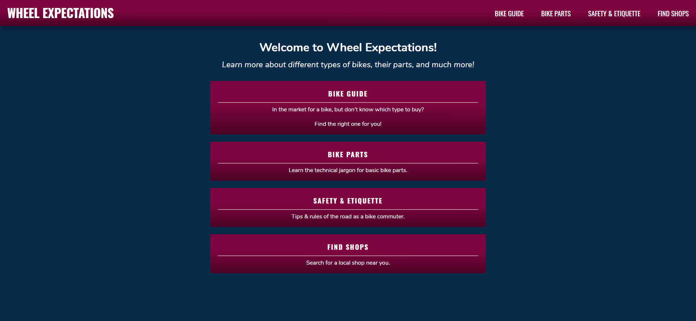
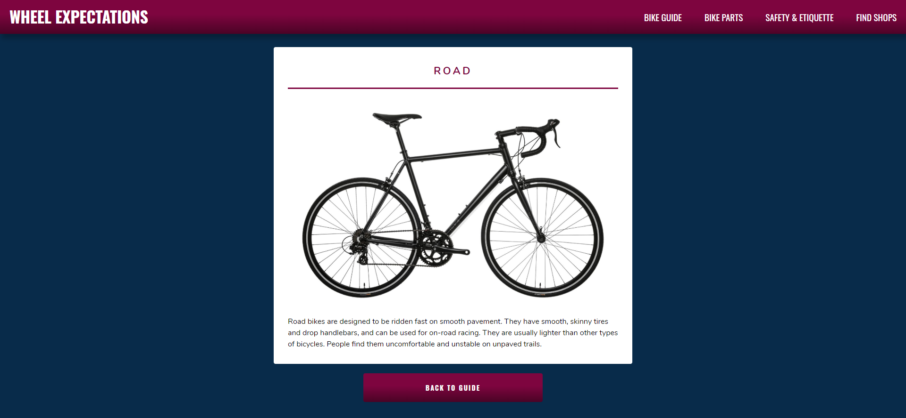
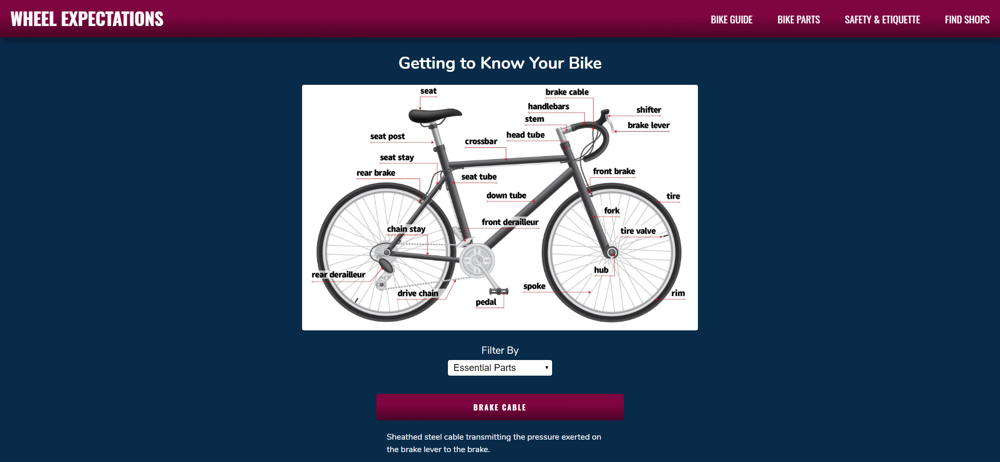
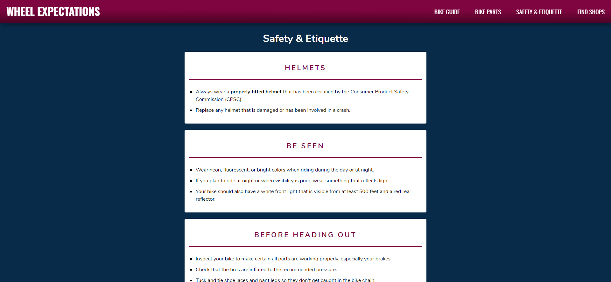
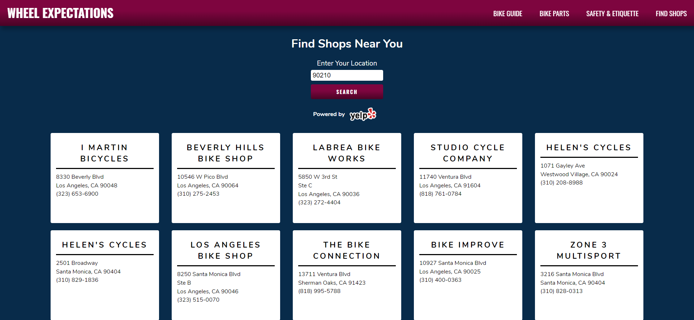

# Wheel Expectations

[LIVE APP](https://wheel-expectations-client.now.sh/)

## Summary

This app was created to educate new and experienced riders: the rider who wants to find a list of local shops, the new rider that is looking for a new bike, but isn't informed about the rules of the road, and the experienced rider who needs to explain to a bike shop employee which part of their bike is malfunctioning.

## A Walk Through the App

**Home**



**Bike Info**



**Parts List**



**Safety & Etiquette**



**Find Shops**



## API Documentation

**Request**

```bash
GET https://damp-reaches-21503.herokuapp.com/api
```

**Endpoints**

Get a list of categorized bikes and their description.

```bash
/bikes
```

Get a list of essential and non-essential bike parts and their description.

```bash
/parts
```

## Technologies

* React
* CSS
* Node
* Express
* PostgreSQL
* Yelp Fusion API